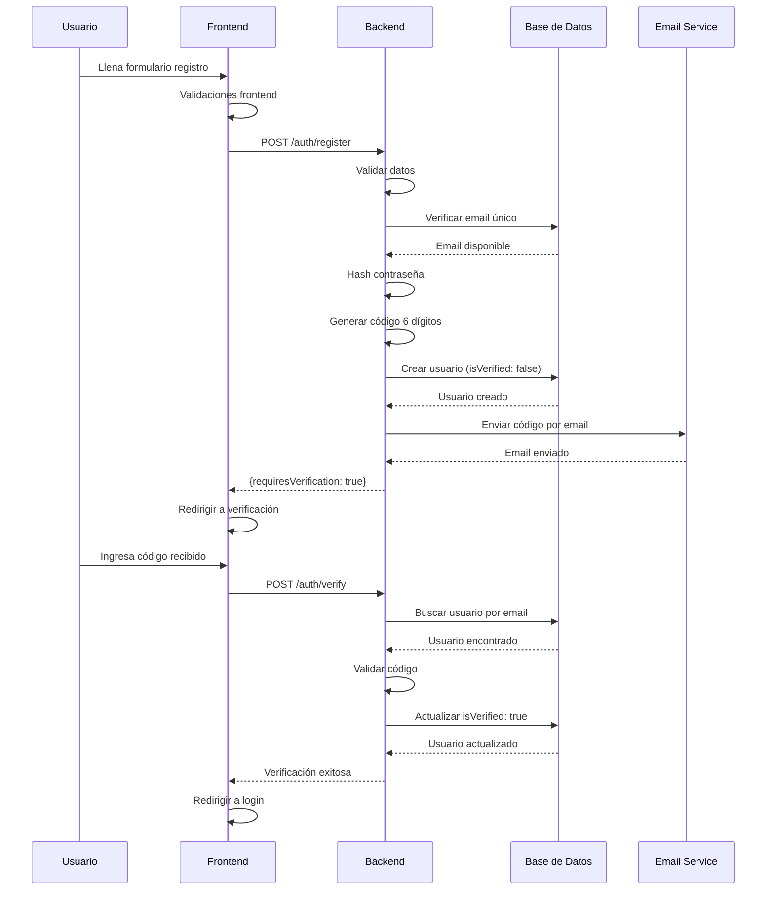
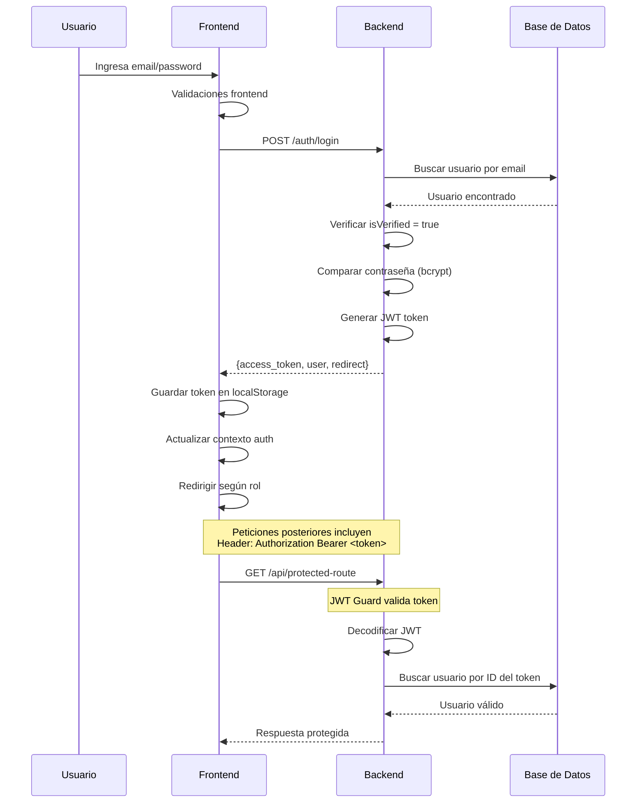
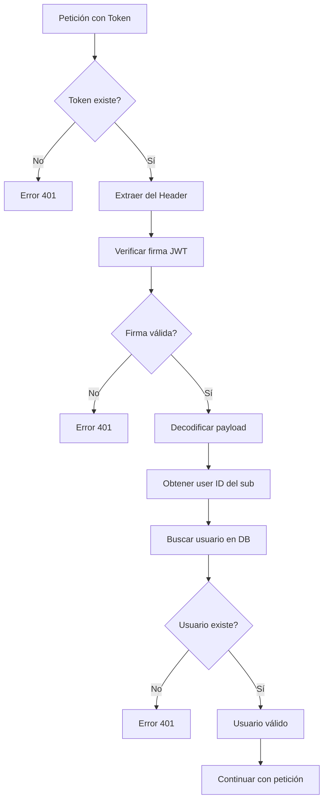

# 🔐 Flujo de Autenticación - Sistema Orto-Whave

Este documento explica en detalle el funcionamiento del sistema de autenticación de la aplicación Orto-Whave, incluyendo registro, inicio de sesión, verificación por email y el uso de JWT (JSON Web Tokens).

## 📋 Tabla de Contenidos

1. [Introducción](#introducción)
2. [¿Qué son los JWT?](#qué-son-los-jwt)
3. [Flujo de Registro](#flujo-de-registro)
4. [Flujo de Inicio de Sesión](#flujo-de-inicio-de-sesión)
5. [Archivos Involucrados](#archivos-involucrados)
6. [Diagramas de Flujo](#diagramas-de-flujo)
7. [Seguridad](#seguridad)

## 🌟 Introducción

El sistema de autenticación de Orto-Whave utiliza una arquitectura basada en **JWT (JSON Web Tokens)** para manejar la autenticación y autorización de usuarios. El flujo incluye:

- **Registro** con verificación por email
- **Inicio de sesión** con generación de tokens JWT
- **Gestión de roles** (admin, doctor, paciente)
- **Protección de rutas** mediante guards
- **Persistencia de sesión** en localStorage

---

## 🎯 ¿Qué son los JWT?

### Definición
**JWT (JSON Web Token)** es un estándar abierto (RFC 7519) que define una forma compacta y segura de transmitir información entre partes como un objeto JSON. Esta información puede ser verificada y confiable porque está firmada digitalmente.

### Estructura de un JWT
Un JWT está compuesto por tres partes separadas por puntos (`.`):

```
[HEADER].[PAYLOAD].[SIGNATURE]
```

#### 1. Header (Encabezado)
```json
{
  "alg": "HS256",
  "typ": "JWT"
}
```
- `alg`: Algoritmo usado para firmar el token
- `typ`: Tipo de token

#### 2. Payload (Carga útil)
```json
{
  "email": "usuario@example.com",
  "sub": "123",
  "rol": "paciente",
  "iat": 1635724800,
  "exp": 1635811200
}
```
- `sub`: Subject (ID del usuario)
- `iat`: Issued At (cuando se creó)
- `exp`: Expiration Time (cuando expira)
- Datos personalizados (email, rol, etc.)

#### 3. Signature (Firma)
```javascript
HMACSHA256(
  base64UrlEncode(header) + "." + base64UrlEncode(payload),
  secret
)
```

### ¿Cómo funcionan los JWT en nuestra aplicación?

1. **Generación**: El servidor crea el JWT después de validar credenciales
2. **Envío**: Se envía al frontend en la respuesta de login
3. **Almacenamiento**: Se guarda en localStorage del navegador
4. **Uso**: Se incluye en el header `Authorization: Bearer <token>` en cada petición
5. **Validación**: El servidor verifica la firma en cada petición protegida

### Ventajas de JWT
- ✅ **Stateless**: No requiere almacenamiento en el servidor
- ✅ **Seguro**: Firmado digitalmente
- ✅ **Compacto**: Tamaño pequeño
- ✅ **Información incluida**: Contiene datos del usuario
- ✅ **Escalable**: Perfecto para aplicaciones distribuidas

---

## 📝 Flujo de Registro

### Paso a Paso

#### 1. Frontend - Formulario de Registro
**Archivo**: `frontend/my-app/src/pages/RegisterPage.jsx`

```javascript
const userData = {
  nombre: formData.firstName.trim(),
  apellido: formData.lastName.trim(),
  email: formData.email.trim().toLowerCase(),
  telefono: formData.phone.trim(),
  password: formData.password,
  rolId: 3 // Siempre paciente para registro público
};

const response = await register(userData);
```

**Validaciones del frontend:**
- ✅ Todos los campos requeridos
- ✅ Email válido
- ✅ Teléfono mínimo 10 dígitos
- ✅ Contraseña mínimo 6 caracteres
- ✅ Confirmación de contraseña

#### 2. Servicio de Autenticación
**Archivo**: `frontend/my-app/src/services/auth.service.ts`

```javascript
async register(userData: RegisterData): Promise<RegisterResponse> {
  try {
    const response = await api.post('/auth/register', userData);
    return response.data;
  } catch (error) {
    // Manejo de errores...
  }
}
```

#### 3. Backend - Controlador de Autenticación
**Archivo**: `backend/src/auth/auth.controller.ts`

```typescript
@Post('register')
async register(@Body(ValidationPipe) registerDto: RegisterDto) {
  return this.authService.register(registerDto);
}
```

#### 4. Backend - Servicio de Autenticación
**Archivo**: `backend/src/auth/auth.service.ts`

**Proceso interno:**

1. **Validación de datos**
```typescript
if (!userData.nombre || !userData.apellido || !userData.email || !userData.password) {
  throw new BadRequestException('Todos los campos son obligatorios.');
}
```

2. **Verificar email único**
```typescript
const existingUser = await this.usersRepository.findOne({
  where: { email: userData.email },
});

if (existingUser) {
  throw new ConflictException('El correo electrónico ya está registrado');
}
```

3. **Generar código de verificación**
```typescript
const randomNum = Math.floor(100000 + Math.random() * 900000);
const verificationCode = randomNum.toString().padStart(6, '0');
```

4. **Hashear contraseña**
```typescript
const saltRounds = 12;
const hashedPassword = await bcrypt.hash(userData.password, saltRounds);
```

5. **Crear usuario**
```typescript
const newUser = this.usersRepository.create({
  ...userData,
  password: hashedPassword,
  rolId: userData.rolId || 3,
  isVerified: false,
  verificationCode,
  isApproved: false,
  approvalStatus: 'pending',
});

await this.usersRepository.save(newUser);
```

6. **Enviar email de verificación**
```typescript
await this.mailerService.sendMail({
  to: userData.email,
  subject: 'Código de verificación - Orto-Whave',
  template: './verification-code',
  context: {
    name: userData.nombre,
    verificationCode: verificationCode,
    email: userData.email,
  },
});
```

#### 5. Respuesta y Redirección
```typescript
return {
  message: 'Usuario registrado exitosamente. Hemos enviado un código de verificación a tu correo electrónico.',
  email: userData.email,
  requiresVerification: true,
};
```

El frontend recibe esta respuesta y redirige a:
```javascript
if (response && response.requiresVerification === true) {
  navigate(`/verify-email?email=${encodeURIComponent(userData.email)}`);
}
```

### Verificación por Email

#### Archivo de Verificación: `frontend/my-app/src/pages/VerifyEmailPage.jsx`

El usuario ingresa el código de 6 dígitos recibido por email:

```javascript
const response = await authService.verifyCode(email, code);
```

#### Backend - Verificación de Código
**Archivo**: `backend/src/auth/auth.service.ts`

```typescript
async verifyCode(email: string, code: string) {
  const user = await this.usersRepository.findOne({ 
    where: { email },
    relations: ['rol']
  });

  // Validar código
  if (storedCode !== receivedCode) {
    throw new UnauthorizedException('Código de verificación incorrecto');
  }
  
  // Marcar como verificado
  user.isVerified = true;
  user.verificationCode = null;
  await this.usersRepository.save(user);
  
  return { message: 'Cuenta verificada exitosamente.' };
}
```

---

## 🔑 Flujo de Inicio de Sesión

### Paso a Paso

#### 1. Frontend - Formulario de Login
**Archivo**: `frontend/my-app/src/pages/LoginPage.jsx`

```javascript
const response = await login(email, password);

// Redirección basada en rol
const redirectPath = getRedirectPathByRole(response.user.rol);
navigate(redirectPath, { replace: true });
```

#### 2. Context de Autenticación
**Archivo**: `frontend/my-app/src/context/AuthContext.tsx`

```typescript
const login = async (email: string, password: string) => {
  const response = await authService.login(email, password);
  const userWithRole: User = {
    ...response.user,
    rol: mapRoleToValidRole(response.user.rol || ''),
    id: response.user.id.toString(),
  };
  
  setUser(userWithRole);
  setToken(response.access_token);
  setIsAuthenticated(true);
  
  return { ...response, user: userWithRole };
};
```

#### 3. Servicio de Autenticación Frontend
**Archivo**: `frontend/my-app/src/services/auth.service.ts`

```typescript
async login(email: string, password: string): Promise<LoginResponse> {
  const response = await api.post('/auth/login', {
    email,
    password,
  });
  
  // Guardar en localStorage
  localStorage.setItem('token', response.data.access_token);
  localStorage.setItem('user', JSON.stringify(response.data.user));
  
  return response.data;
}
```

#### 4. Backend - Controlador
**Archivo**: `backend/src/auth/auth.controller.ts`

```typescript
@Post('login')
async login(@Body(ValidationPipe) loginDto: LoginDto) {
  const user = await this.authService.validateUser(
    loginDto.email,
    loginDto.password,
  );
  
  if (!user) {
    throw new UnauthorizedException('Credenciales inválidas');
  }
  
  return this.authService.login(user);
}
```

#### 5. Backend - Validación de Usuario
**Archivo**: `backend/src/auth/auth.service.ts`

```typescript
async validateUser(email: string, password: string): Promise<any> {
  const user = await this.usersRepository.findOne({
    where: { email },
    relations: ['rol'],
  });

  if (!user) {
    return { 
      error: 'USER_NOT_FOUND', 
      message: 'No existe una cuenta registrada con este correo electrónico.' 
    };
  }

  // Verificar email verificado
  if (!user.isVerified) {
    return { 
      error: 'EMAIL_NOT_VERIFIED', 
      message: 'La cuenta no ha sido verificada.'
    };
  }

  // Verificar contraseña
  const isPasswordValid = await bcrypt.compare(password, user.password);
  
  if (isPasswordValid) {
    const { password, ...result } = user;
    return result;
  } else {
    return { 
      error: 'INVALID_PASSWORD', 
      message: 'La contraseña ingresada es incorrecta.' 
    };
  }
}
```

#### 6. Generación del JWT
```typescript
async login(user: any) {
  const payload = {
    email: user.email,
    sub: user.id,
    rol: user.rol.nombre,
  };

  const token = this.jwtService.sign(payload);

  return {
    access_token: token,
    user: {
      id: user.id,
      email: user.email,
      nombre: user.nombre,
      apellido: user.apellido,
      rol: user.rol.nombre,
    },
    redirect: this.getRedirectPath(user.rol.nombre),
  };
}
```

#### 7. Estrategia JWT para Validación
**Archivo**: `backend/src/auth/jwt.strategy.ts`

```typescript
async validate(payload: any) {
  const user = await this.usersRepository.findOne({
    where: { id: payload.sub },
    relations: ['rol', 'paciente', 'perfilMedico'],
  });

  if (!user) {
    throw new UnauthorizedException('Usuario no encontrado');
  }

  return user;
}
```

---

## 📁 Archivos Involucrados

### Frontend (React/TypeScript)

#### 🎨 Páginas (UI)
```
frontend/my-app/src/pages/
├── LoginPage.jsx                    # Formulario de inicio de sesión
├── RegisterPage.jsx                 # Formulario de registro
├── VerifyEmailPage.jsx             # Verificación por código email
└── VerificationPage.jsx            # Página de verificación general
```

#### 🧠 Lógica de Negocio
```
frontend/my-app/src/
├── context/
│   └── AuthContext.tsx             # Contexto global de autenticación
├── services/
│   ├── auth.service.ts             # Servicios de autenticación
│   └── api.js                      # Cliente HTTP configurado
├── utils/
│   └── auth.ts                     # Utilidades de autenticación
└── hooks/
    ├── useAuth.ts                  # Hook personalizado de auth
    └── useAppointmentRequests.ts   # Hooks relacionados con auth
```

#### 🛡️ Componentes de Protección
```
frontend/my-app/src/components/
├── ProtectedRoute.jsx              # Rutas protegidas
├── AuthModal.jsx                   # Modal de autenticación
└── AutoRedirect.tsx                # Redirección automática
```

### Backend (NestJS/TypeScript)

#### 🎯 Autenticación
```
backend/src/auth/
├── auth.controller.ts              # Controlador de endpoints de auth
├── auth.service.ts                 # Lógica de negocio de auth
├── auth.module.ts                  # Módulo de autenticación
├── jwt.strategy.ts                 # Estrategia JWT para Passport
└── guards/
    └── jwt-auth.guard.ts           # Guard para proteger rutas
```

#### 📝 DTOs (Data Transfer Objects)
```
backend/src/auth/dto/
├── login.dto.ts                    # DTO para login
├── register.dto.ts                 # DTO para registro
├── register-patient-simple.dto.ts # DTO registro paciente simple
├── verify.dto.ts                   # DTO para verificación
├── forgot-password.dto.ts          # DTO recuperar contraseña
└── reset-password.dto.ts           # DTO resetear contraseña
```

#### 👥 Entidades
```
backend/src/users/
├── entities/
│   └── user.entity.ts              # Entidad Usuario con campos de auth
├── users.controller.ts             # Controlador de usuarios
└── users.service.ts                # Servicio de usuarios
```

#### 🔧 Configuración
```
backend/src/config/
├── database.config.ts              # Configuración de base de datos
└── mail.config.ts                  # Configuración de email
```

#### 📧 Plantillas de Email
```
backend/src/templates/
├── verification-code.hbs           # Plantilla código verificación
├── reset-password.hbs              # Plantilla reset contraseña
└── password-changed.hbs            # Plantilla contraseña cambiada
```

---

## 🗂️ Estructura de la Base de Datos

### Tabla Users
```sql
CREATE TABLE users (
    id INT PRIMARY KEY AUTO_INCREMENT,
    email VARCHAR(255) UNIQUE NOT NULL,
    password VARCHAR(255) NOT NULL,
    nombre VARCHAR(100) NOT NULL,
    apellido VARCHAR(100),
    telefono VARCHAR(20),
    rolId INT,
    isVerified BOOLEAN DEFAULT FALSE,
    verificationCode VARCHAR(6),
    isApproved BOOLEAN DEFAULT FALSE,
    approvalStatus ENUM('pending', 'approved', 'rejected') DEFAULT 'pending',
    resetPasswordToken VARCHAR(255),
    resetPasswordExpires DATETIME,
    created_at TIMESTAMP DEFAULT CURRENT_TIMESTAMP,
    updated_at TIMESTAMP DEFAULT CURRENT_TIMESTAMP ON UPDATE CURRENT_TIMESTAMP,
    FOREIGN KEY (rolId) REFERENCES roles(id)
);
```

### Tabla Roles
```sql
CREATE TABLE roles (
    id INT PRIMARY KEY AUTO_INCREMENT,
    nombre VARCHAR(50) NOT NULL,
    descripcion TEXT
);

-- Datos iniciales
INSERT INTO roles VALUES 
(1, 'admin', 'Administrador del sistema'),
(2, 'doctor', 'Doctor especialista'),
(3, 'paciente', 'Paciente del sistema');
```

---

## 📊 Diagramas de Flujo

### 🔐 Flujo de Registro



### 🔑 Flujo de Inicio de Sesión



### 🛡️ Flujo de Validación JWT



---

## 🔒 Seguridad

### Medidas Implementadas

#### 1. **Contraseñas**
- ✅ Hash con **bcrypt** (12 rounds)
- ✅ Validación de longitud mínima
- ✅ No se almacenan en texto plano

#### 2. **JWT Tokens**
- ✅ Firmados con **HMAC SHA256**
- ✅ Incluyen fecha de expiración
- ✅ Secret key configurable por environment
- ✅ Validación en cada petición protegida

#### 3. **Validación de Email**
- ✅ Código de 6 dígitos aleatorio
- ✅ Verificación obligatoria para activar cuenta
- ✅ Plantillas de email profesionales

#### 4. **Protección de Rutas**
- ✅ **JwtAuthGuard** en endpoints protegidos
- ✅ **ProtectedRoute** en el frontend
- ✅ Verificación de roles por endpoint

#### 5. **Validación de Datos**
- ✅ **ValidationPipe** en todos los endpoints
- ✅ DTOs con decoradores de validación
- ✅ Sanitización de inputs

#### 6. **Manejo de Errores**
- ✅ Mensajes específicos por tipo de error
- ✅ No exposición de información sensible
- ✅ Logging detallado para debugging

#### 7. **Reset de Contraseña**
- ✅ Token único y temporal (1 hora)
- ✅ Confirmación por email
- ✅ Limpieza automática de tokens expirados

### Configuración de Seguridad

#### Variables de Entorno
```env
# JWT
JWT_SECRET=your_super_secret_key_change_in_production
JWT_EXPIRES_IN=24h

# Database
DB_HOST=localhost
DB_PORT=3306
DB_USERNAME=root
DB_PASSWORD=your_password
DB_DATABASE=orto_whave

# Email
MAIL_HOST=smtp.gmail.com
MAIL_PORT=587
MAIL_USERNAME=your_email@gmail.com
MAIL_PASSWORD=your_app_password
```

#### Interceptores y Middleware
```typescript
// Logging de todas las peticiones
@Injectable()
export class LoggingInterceptor implements NestInterceptor {
  intercept(context: ExecutionContext, next: CallHandler): Observable<any> {
    const request = context.switchToHttp().getRequest();
    console.log(`${request.method} ${request.url}`);
    return next.handle();
  }
}
```

---

## 🚀 Flujo Completo Resumido

### Registro (Primera vez)
1. **Usuario** → Llena formulario → **Frontend**
2. **Frontend** → Valida datos → **Backend** `/auth/register`
3. **Backend** → Crea usuario + Envía email → **Email Service**
4. **Usuario** → Recibe código → Ingresa en **Frontend**
5. **Frontend** → **Backend** `/auth/verify` → Cuenta activada ✅

### Login (Uso normal)
1. **Usuario** → Email/Password → **Frontend**
2. **Frontend** → **Backend** `/auth/login`
3. **Backend** → Valida credenciales → Genera **JWT**
4. **Frontend** → Guarda token → Actualiza estado
5. **Usuario** → Redirigido al dashboard correspondiente 🏠

### Peticiones Protegidas
1. **Frontend** → Adjunta `Authorization: Bearer <token>`
2. **Backend** → **JWT Guard** valida token
3. **Backend** → Ejecuta lógica → Respuesta ✅

---

## 🎯 Puntos Clave a Recordar

### Para Desarrolladores Frontend
- 🔑 **Token se guarda en localStorage**
- 🔄 **AuthContext maneja el estado global**
- 🛡️ **ProtectedRoute** protege rutas privadas
- 🎭 **Roles determinan la redirección**

### Para Desarrolladores Backend  
- 🔐 **JWT Strategy** valida tokens automáticamente
- 👮 **Guards** protegen endpoints específicos
- 📝 **DTOs** validan datos de entrada
- 🗄️ **Relations** cargan datos relacionados (rol, perfil)

### Para Testing
- 🧪 **Credenciales de prueba** disponibles en LoginPage
- 📧 **Codes de verificación** se loggean en consola (desarrollo)
- 🔍 **Logs detallados** en AuthService para debugging

---

¡Con esta documentación tienes una visión completa del flujo de autenticación! 🎉

¿Necesitas que profundice en algún aspecto específico o tienes preguntas sobre la implementación?
